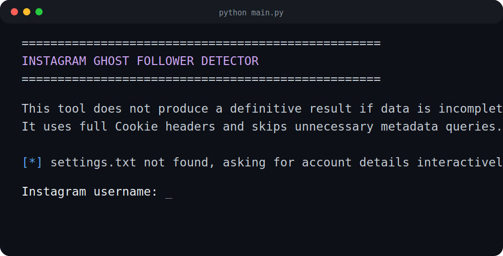

# Instagram Ghost Follower Detector

Python CLI tool for finding Instagram followers who did not like or comment on your recent posts.

The tool is conservative by design. It only writes a definitive ghost follower list when follower, like, and comment data is complete. If Instagram returns partial data, rate limits the session, or blocks an endpoint temporarily, the scan stops and writes an incomplete scan report instead of producing a misleading result.

## Preview



## Features

- Analyzes the latest `30` posts by default.
- Verifies the Instagram session before scanning.
- Reads credentials from local `settings.txt` when available.
- Asks for username and Cookie header interactively when `settings.txt` is missing.
- Creates or updates local `settings.txt` after a successful session verification.
- Uses `followers.txt` first when available to avoid Instagram's follower endpoint.
- Collects followers slowly when `followers.txt` is not available.
- Saves `followers.partial.txt` and `followers.state.pkl` so restricted follower scans can continue later.
- Collects likes and comments for each analyzed post.
- Saves completed post analysis progress to `scan_progress.json` so interrupted scans can resume.
- Stops when data is incomplete instead of generating unreliable results.
- Writes completed ghost follower results to `ghost_followers.txt`.
- Writes incomplete scan details to `scan_report.txt`.

## Requirements

- Python 3
- `instaloader==4.15.1`
- `colorama==0.4.6`

Install dependencies:

```bash
pip install -r requirements.txt
```

## Usage

Run the tool:

```bash
python main.py
```

On the first successful run, the tool asks for:

- Instagram username
- Full Instagram Cookie header from your browser DevTools Network tab

After the session is verified, the tool creates a local `settings.txt` file automatically. Future runs reuse that file unless you delete or edit it.

## Settings

`settings.txt` is local-only and ignored by git.

Example:

```txt
USERNAME = your.instagram.username
COOKIE = full_cookie_header_here
SLOW_MODE = yes
```

`SLOW_MODE = yes` is recommended and is the default when the setting is missing. In slow mode:

- Follower collection waits `75-150` seconds after every `12` followers.
- Follower collection cools down for `5-10` minutes after every `120` fetched follower records.
- Post analysis waits `30-90` seconds between posts.

Runtime depends heavily on follower count and post engagement. Larger accounts can take several hours in slow mode.

## Follower List Options

The safest option for larger accounts is to provide a local `followers.txt` file with one username per line.

When `followers.txt` exists, the tool uses it instead of calling Instagram's follower endpoint. This reduces rate-limit risk.

If `followers.txt` is not available, the tool collects followers from Instagram slowly. If Instagram restricts the follower endpoint, progress is saved locally:

- `followers.partial.txt`: follower usernames collected before the restriction
- `followers.state.pkl`: binary resume cursor used to continue follower collection later

These files are ignored by git and should not be committed.

## Post Analysis Resume

Completed post analysis is saved to `scan_progress.json` after each fully scanned post. If likes or comments fail on a later post, the next run skips already completed posts and retries the remaining posts.

Progress is reused only when the account and recent post list match the saved state. If the recent post list changes, the old progress is ignored and the scan starts fresh.

## Output Files

- `ghost_followers.txt`: generated only when the scan completes cleanly.
- `scan_report.txt`: written when the scan is incomplete or an endpoint fails.
- `followers.partial.txt`: partial follower progress for interrupted follower collection.
- `followers.state.pkl`: local binary cursor for resuming follower collection.
- `scan_progress.json`: local post analysis progress for resuming interrupted scans.

## Rate Limit Behavior

Instagram may temporarily restrict follower, like, or comment endpoints. The tool treats these as stop conditions:

- `feedback_required`
- `checkpoint_required`
- `challenge_required`
- `Please wait a few minutes before you try again`
- `401 Unauthorized`
- `429`
- `too many requests`
- `rate limit`

If this happens, wait a few hours and use Instagram normally in the browser before retrying.

## Security

Your Cookie header is equivalent to a logged-in Instagram session.

- Do not share `settings.txt`.
- Do not commit real Cookie values.
- Rotate your Instagram session if a Cookie header was exposed.
- Keep generated local files out of public repositories.

The repository intentionally ignores local settings and runtime files through `.gitignore`.

## Project Files

- `main.py`: main CLI tool.
- `requirements.txt`: Python dependencies.
- `README.md`: project documentation.
- `.gitignore`: excludes local secrets, outputs, caches, and runtime resume files.
